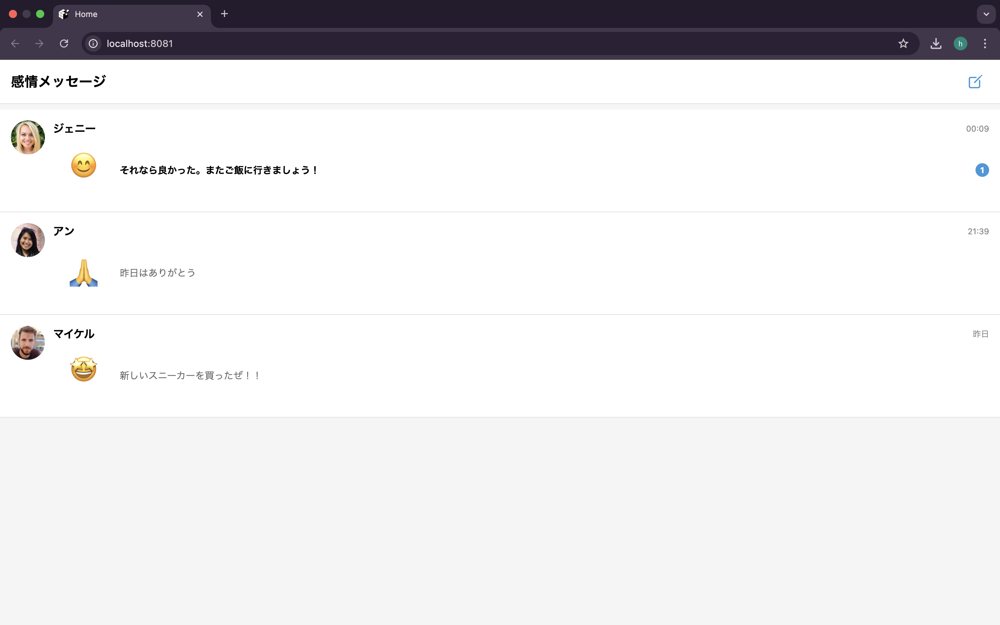
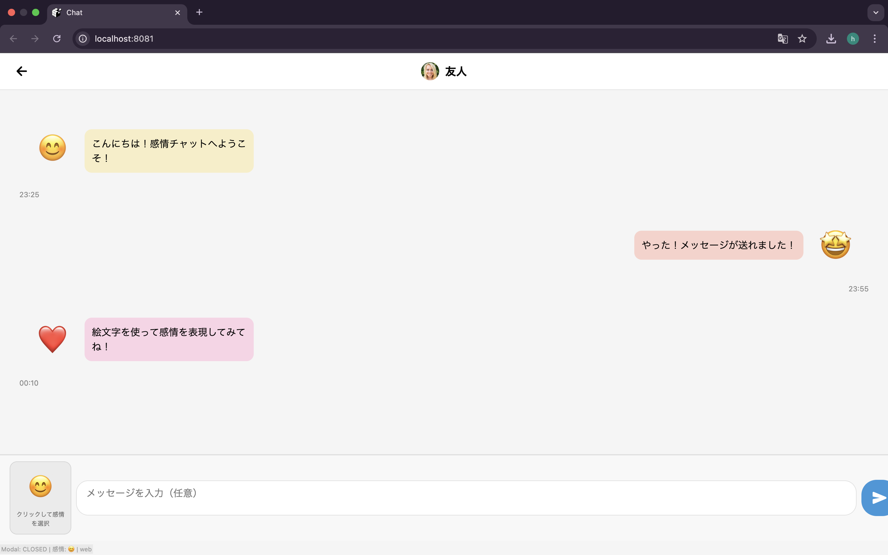
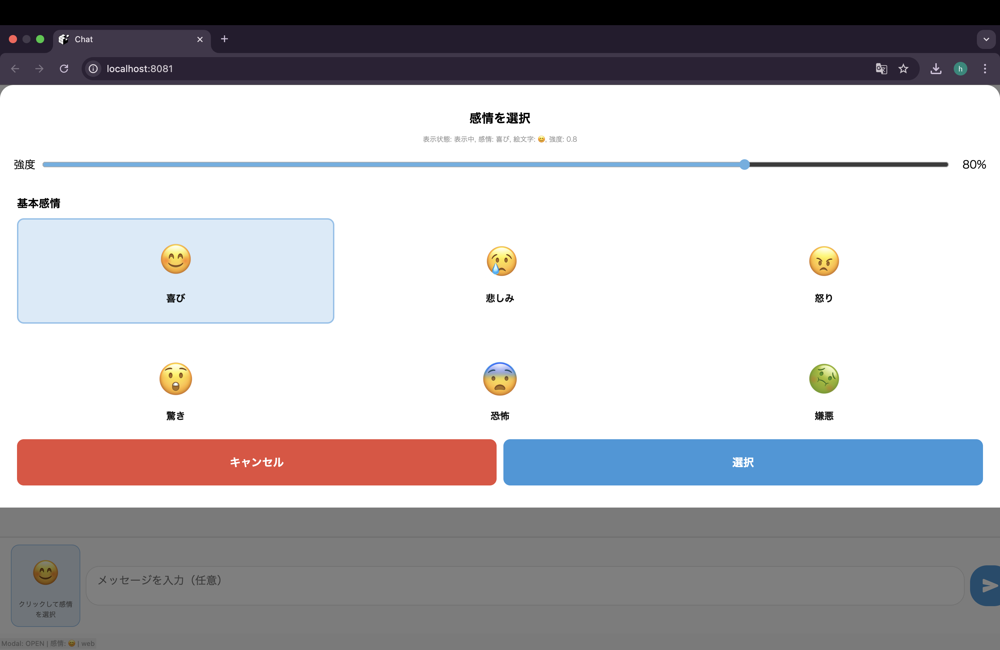

# Sencing Messages | 感情を色と動きで表現する非言語チャットアプリ

<div align="center">
  
  <p>
    <em>感情をカラフルに伝える次世代チャットアプリケーション</em>
  </p>
</div>

[English](#english-version) | [日本語](#japanese-version)

---

<a id="japanese-version"></a>
## 日本語版

Sencing Messages（センシングメッセージ）は、感情を色や動き、振動パターンで表現する革新的な非言語チャットアプリケーションです。テキストメッセージだけでは伝えきれない感情やニュアンスを、抽象的な視覚・触覚表現で共有することを可能にします。

### プロジェクトの概要

このアプリケーションは、HCI（Human-Computer Interaction）研究の一環として開発され、感情コミュニケーションの新しい形を模索しています。主な特徴は以下の通りです：

- **感情を色と形で表現**: 喜び、悲しみ、怒りなどの感情を、特徴的な色と形で表現
- **アニメーションによる動的表現**: 感情の強さや種類に応じた多様なアニメーションパターン
- **触覚フィードバック**: 感情に合わせた振動パターンで、視覚以外のチャネルでも感情を伝達
- **テキストとの併用オプション**: 必要に応じてテキストメッセージを追加可能

### スクリーンショット

| ホーム画面 | チャット画面 | 感情選択画面 |
|:-------------------------:|:-------------------------:|:-------------------------:|
|  |  |  |

### 技術スタック

- React Native / Expo
- TypeScript
- React Navigation
- React Native Reanimated
- React Native Gesture Handler
- Expo Haptics

### 主要な機能

1. **感情バブル**: 色、形、アニメーションで感情を表現する視覚的要素
2. **感情セレクター**: 直感的に感情とその強度を選択できるUI
3. **触覚フィードバック**: 感情に合わせたデバイスの振動パターン
4. **会話履歴**: 送受信した感情メッセージの履歴表示

### プロジェクト構造

```
SencingMessages/
├── assets/                  # アイコン、スプラッシュ画像など
├── src/
│   ├── animations/          # アニメーション関連のユーティリティ
│   ├── components/          # 再利用可能なUIコンポーネント
│   ├── contexts/            # React Contextとプロバイダー
│   ├── hooks/               # カスタムReact Hooks
│   ├── navigation/          # 画面ナビゲーション設定
│   ├── screens/             # アプリケーション画面
│   ├── types/               # TypeScriptの型定義
│   └── utils/               # ヘルパー関数やユーティリティ
├── App.tsx                  # アプリケーションのエントリーポイント
└── package.json             # プロジェクト依存関係
```

### セットアップ方法

```bash
# プロジェクトのクローン
git clone https://github.com/yourusername/SencingMessages.git
cd SencingMessages

# 依存関係のインストール
npm install

# iOSシミュレータで実行
npm run ios

# Androidエミュレータで実行
npm run android

# 開発サーバーを起動
npm start
```

### 使用方法

1. アプリを起動
2. 会話相手を選択
3. 「感情バブル」ボタンをタップして感情セレクターを表示
4. 伝えたい感情とその強度を選択
5. 必要に応じてテキストメッセージを入力
6. 送信ボタンをタップ

### カスタマイズ

- `src/utils/emotions.ts` ファイルで新しい感情の定義を追加できます
- `src/animations/emotionAnimations.ts` ファイルでアニメーションパターンを編集できます

### 貢献方法

プロジェクトへの貢献に興味がある方は、以下の手順で参加できます：

1. このリポジトリをフォーク
2. 新しい機能用のブランチを作成 (`git checkout -b feature/amazing-feature`)
3. 変更をコミット (`git commit -m 'Add some amazing feature'`)
4. ブランチにプッシュ (`git push origin feature/amazing-feature`)
5. Pull Requestを作成

### 今後の展望

- 感情の混合機能（複数の感情を組み合わせる）
- AIによる感情推定サポート
- よりパーソナライズされた感情表現オプション
- グループチャット対応
- 国際化対応

### ライセンス

MIT

### 開発者

[Your Name] - [Your Contact Information or GitHub Profile]

---

<a id="english-version"></a>
## English Version

# Sencing Messages - Non-verbal Chat App Expressing Emotions Through Colors and Movements

Sencing Messages is an innovative non-verbal chat application that expresses emotions through colors, movements, and vibration patterns. It enables sharing feelings and nuances that cannot be fully conveyed through text messages alone, using abstract visual and tactile expressions.

### Project Overview

This application was developed as part of HCI (Human-Computer Interaction) research, exploring new forms of emotional communication. Key features include:

- **Emotion Expression through Colors and Shapes**: Express emotions like joy, sadness, and anger through distinctive colors and shapes
- **Dynamic Expression through Animation**: Various animation patterns corresponding to the type and intensity of emotions
- **Tactile Feedback**: Convey emotions through vibration patterns, enabling communication through non-visual channels
- **Optional Text Integration**: Add text messages when needed

### Screenshots

| Home Screen | Chat Screen | Emotion Selector |
|:-------------------------:|:-------------------------:|:-------------------------:|
|  |  |  |

### Technology Stack

- React Native / Expo
- TypeScript
- React Navigation
- React Native Reanimated
- React Native Gesture Handler
- Expo Haptics

### Key Features

1. **Emotion Bubbles**: Visual elements that express emotions through color, shape, and animation
2. **Emotion Selector**: Intuitive UI for selecting emotions and their intensity
3. **Haptic Feedback**: Device vibration patterns that match emotions
4. **Conversation History**: Display history of sent and received emotion messages

### Project Structure

```
SencingMessages/
├── assets/                  # Icons, splash images, etc.
├── src/
│   ├── animations/          # Animation-related utilities
│   ├── components/          # Reusable UI components
│   ├── contexts/            # React Contexts and providers
│   ├── hooks/               # Custom React Hooks
│   ├── navigation/          # Screen navigation configuration
│   ├── screens/             # Application screens
│   ├── types/               # TypeScript type definitions
│   └── utils/               # Helper functions and utilities
├── App.tsx                  # Application entry point
└── package.json             # Project dependencies
```

### Setup Instructions

```bash
# Clone the project
git clone https://github.com/yourusername/SencingMessages.git
cd SencingMessages

# Install dependencies
npm install

# Run on iOS simulator
npm run ios

# Run on Android emulator
npm run android

# Start development server
npm start
```

### How to Use

1. Launch the app
2. Select a conversation partner
3. Tap the "Emotion Bubble" button to display the emotion selector
4. Select the emotion you want to convey and its intensity
5. Enter a text message if needed
6. Tap the send button

### Customization

- Add new emotion definitions in the `src/utils/emotions.ts` file
- Edit animation patterns in the `src/animations/emotionAnimations.ts` file

### How to Contribute

If you're interested in contributing to the project, please follow these steps:

1. Fork this repository
2. Create a branch for your new feature (`git checkout -b feature/amazing-feature`)
3. Commit your changes (`git commit -m 'Add some amazing feature'`)
4. Push to the branch (`git push origin feature/amazing-feature`)
5. Create a Pull Request

### Future Prospects

- Emotion mixing feature (combining multiple emotions)
- AI-assisted emotion estimation
- More personalized emotion expression options
- Group chat support
- Internationalization

### License

MIT

### Developer

[Your Name] - [Your Contact Information or GitHub Profile] 
